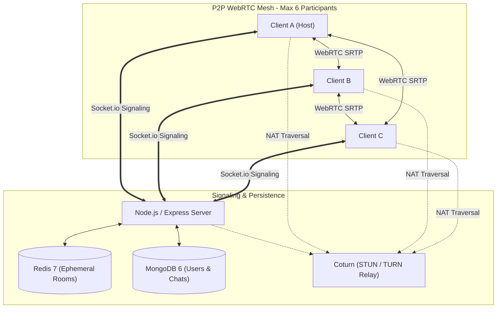

# MeetSpace

MeetSpace is an enterprise-grade, multi-user Zoom-style video meeting platform built with the MERN stack, Redis, and native browser WebRTC APIs.

Media flows directly browser-to-browser over an encrypted peer-to-peer mesh topology. The server never decodes or handles raw audio/video media.

---

## Architecture Diagram



---

## Features

- **P2P WebRTC Mesh**: Multi-party video and audio with zero server media handling.
- **Pre-Join Green Room**: Camera & mic preview, hardware device selectors, and audio feedback meters.
- **Screen Sharing**: Native display capture using `RTCRtpSender.replaceTrack` with zero SDP renegotiation and automatic detection of the browser's "Stop sharing" button.
- **Active Speaker Highlighting**: Real-time volume analysis using Web Audio `AnalyserNode` with dynamic glowing border indicators.
- **Host Moderation Controls**:
  - Remote mute individual participants or Mute All.
  - Kick / remove participants.
  - Lock room against new arrivals.
  - Waiting room lobby with host Admit/Deny controls.
  - Automatic host failover to the longest-present participant if the host departs.
- **In-Room Chat**: Real-time, XSS-sanitized chat transcripts persisted to MongoDB.
- **Connection Quality Badge**: Live metrics via `RTCPeerConnection.getStats()` displaying RTT, packet loss, and bitrate.
- **Graceful Error Recovery**: Reconnecting status indicators, automatic ICE restart on failure, and listen-only fallback for denied hardware permissions.

---

## Tech Stack

- **Frontend**: React 18, Vite, JavaScript (ES modules), Tailwind CSS v4, Zustand, Axios, socket.io-client, native browser WebRTC.
- **Backend**: Node.js 20, Express, Socket.io 4, MongoDB + Mongoose, Redis, JSON Web Tokens (JWT) + httpOnly refresh cookies, bcrypt, Zod, Helmet, Pino.
- **Infra & Tooling**: Docker Compose (server, client, mongo, redis, coturn), Coturn TURN/STUN, Jest + Supertest, Playwright E2E.

---

## Quick Start (Docker Compose)

To start the complete system (Client, Server, MongoDB, Redis, and Coturn):

```bash
# Clone the repository
git clone https://github.com/your-username/meetspace.git
cd meetspace

# Start all services with Docker Compose
docker-compose up --build
```

- **Frontend**: [http://localhost:5173](http://localhost:5173)
- **Backend API**: [http://localhost:3000/api/v1](http://localhost:3000/api/v1)
- **Coturn TURN**: `localhost:3478`

---

## Local Development Setup

### 1. Backend Setup
```bash
cd server
cp .env.example .env
npm install
npm run dev
```

### 2. Frontend Setup
```bash
cd client
cp .env.example .env
npm install
npm run dev
```

---

## Environment Variables

### Server (`server/.env`)
| Variable | Description | Default |
| :--- | :--- | :--- |
| `PORT` | HTTP & WebSocket server port | `3000` |
| `MONGO_URI` | MongoDB connection URI | `mongodb://localhost:27017/meetspace` |
| `REDIS_URL` | Redis connection URL | `redis://localhost:6379` |
| `JWT_SECRET` | 15-minute access token & join token secret | Required |
| `JWT_REFRESH_SECRET` | 7-day refresh token secret | Required |
| `CORS_ORIGIN` | Allowed client origin | `http://localhost:5173` |
| `TURN_SECRET` | Coturn static auth secret for HMAC credentials | `my_turn_secret` |
| `TURN_URL` | Coturn TURN URI | `turn:localhost:3478` |
| `STUN_URL` | Coturn STUN URI | `stun:localhost:3478` |
| `MAX_PARTICIPANTS` | Maximum mesh peer capacity per room | `6` |

### Client (`client/.env`)
| Variable | Description | Default |
| :--- | :--- | :--- |
| `VITE_API_URL` | Backend REST endpoint | `http://localhost:3000/api/v1` |
| `VITE_SOCKET_URL` | Socket.io signaling server | `http://localhost:3000` |

---

## REST API Reference (`/api/v1`)

| Method | Endpoint | Description | Auth Required |
| :--- | :--- | :--- | :--- |
| `POST` | `/auth/register` | Register new user account | No |
| `POST` | `/auth/login` | Login and receive access token + refresh cookie | No |
| `POST` | `/auth/refresh` | Rotate refresh token and issue new access token | Cookie |
| `POST` | `/auth/logout` | Invalidate refresh token and clear cookie | Cookie |
| `GET` | `/users/me` | Fetch authenticated profile | Bearer JWT |
| `POST` | `/meetings` | Create a new meeting (`title`, `password`, `waitingRoomEnabled`) | Bearer JWT |
| `GET` | `/meetings/:roomId` | Public metadata (exists, requiresPassword, isLocked) | No |
| `POST` | `/meetings/:roomId/verify` | Verify passcode & issue short-lived joinToken | No (Optional) |
| `GET` | `/meetings` | Meeting history hosted by user | Bearer JWT |
| `GET` | `/meetings/:roomId/messages` | Chat history for meeting room | Join Token |
| `GET` | `/ice-servers` | Fetch STUN/TURN configs with HMAC credentials | No |
| `GET` | `/health` | Health check endpoint | No |

---

## Socket.io Event Reference

### Client -> Server
- `room:join { roomId, name, media }`: Join meeting room.
- `room:leave`: Leave active room.
- `signal:offer { to, sdp }`: Relay SDP offer to peer.
- `signal:answer { to, sdp }`: Relay SDP answer to peer.
- `signal:ice-candidate { to, candidate }`: Relay ICE candidate to peer.
- `media:state { audio, video, screen }`: Broadcast media state changes.
- `chat:send { text }`: Send in-room message (HTML sanitized).
- `host:mute { targetId }`: Host mutes participant mic.
- `host:mute-all`: Host mutes all participants.
- `host:remove { targetId }`: Host removes participant from room.
- `host:lock { locked }`: Host toggles room lock.
- `host:admit { targetId }`: Host admits waiting participant.
- `host:deny { targetId }`: Host denies waiting participant.
- `hand:toggle { raised }`: Toggle raised hand.

### Server -> Client
- `room:joined { selfId, participants, isHost, iceServers }`: Sent to newcomer upon entry.
- `room:waiting {}`: Placed into waiting lobby.
- `room:admitted` / `room:denied`: Waiting room status updates.
- `room:participant-joined { participant }`: Broadcast when peer joins.
- `room:participant-left { id }`: Broadcast when peer leaves.
- `room:host-changed { hostId }`: Host failover notification.
- `room:locked { locked }`: Room lock notification.
- `signal:offer / signal:answer / signal:ice-candidate { from, ... }`: Relayed WebRTC signals.
- `media:state { id, audio, video, screen }`: Peer media updates.
- `chat:message { id, senderName, text, createdAt }`: Incoming chat message.
- `host:muted { byHost }`: Mute notification.
- `host:removed {}`: Ejection notification.

---

## Testing

```bash
# Run backend test suite (33 tests)
cd server && npm test

# Run Playwright End-to-End tests with Chrome fake media
cd e2e && npx playwright test
```
See [`docs/TESTING.md`](docs/TESTING.md) for full instructions, including testing over cellular networks with ngrok and verifying TURN relay-only mode.

---

## Known Limits & Future Work

### Mesh Topology Ceiling
MeetSpace operates in a **peer-to-peer mesh**. Each client transmits media directly to every other participant ($N-1$ upstream pipelines).
- Maximum recommended room capacity is **6 participants** (`MAX_PARTICIPANTS=6`).
- Beyond 6 participants, client CPU and uplink bandwidth scale quadratically ($O(N^2)$), causing frame degradation on consumer connections.

### Future Work: Scaling with an SFU
To support larger conferences (e.g. 50–500+ participants), the signaling architecture can be upgraded to interface with a **Selective Forwarding Unit (SFU)** such as **mediasoup** or **LiveKit**. In an SFU architecture:
- Each participant sends only 1 uplink media stream to the server.
- The SFU selectively routes packets to viewers, drastically reducing client upload overhead and supporting simulcast / SVC video streams.
