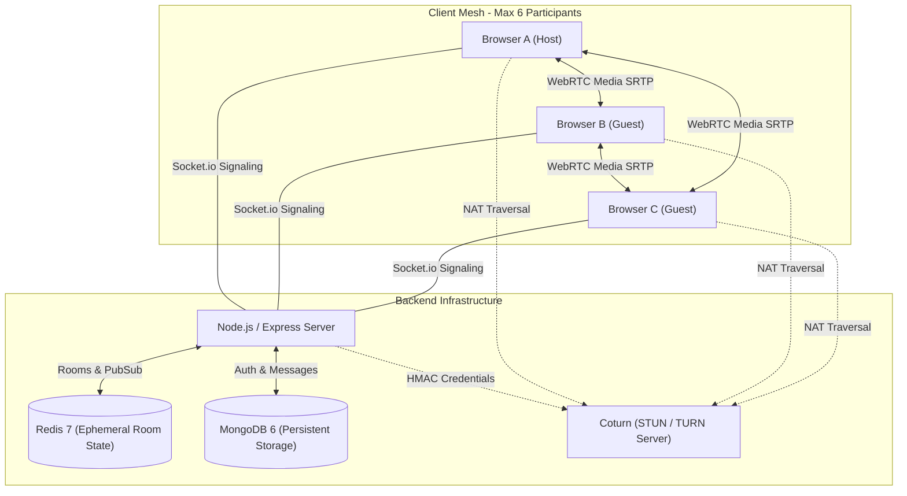

# Baithak Architecture

Baithak is a production-quality video conferencing system built with the MERN stack (MongoDB, Express, React, Node.js), Redis, and native WebRTC APIs.

---

## High-Level Topology: Peer-to-Peer Mesh

Media (audio, video, and screen sharing) flows directly between browsers over SRTP (Secure Real-time Transport Protocol). The Node.js server **never touches raw media packets**. It acts purely as a signaling server, authentication authority, and room coordinator.

---

## Core Components

### 1. Frontend (React 18 + Vite)
- **State Management**: Zustand (`authStore` for authentication and user sessions; `roomStore` for ephemeral in-meeting state).
- **WebRTC Engine**: Native browser `RTCPeerConnection` and `navigator.mediaDevices` APIs without third-party wrapper dependencies.
- **Audio Processing**: Web Audio `AudioContext` with `AnalyserNode` monitoring real-time decibel levels for active speaker detection.
- **Styling**: Tailwind CSS with responsive 1-6 participant video grid layouts.

### 2. Backend (Node.js 20 + Express + Socket.io 4)
- **REST API (`/api/v1`)**:
  - Authentication (`/auth`): Registration, login, token refresh with cookie rotation, and logout.
  - Meetings (`/meetings`): Room creation with unique `xxx-yyyy-zzz` identifiers, passcode validation, public info, and chat history.
  - ICE Servers (`/ice-servers`): Issues time-limited HMAC credentials for Coturn.
- **Socket.io Signaling (`/`)**:
  - Authenticated handshake via JWT `joinToken`.
  - Relays SDP offers, answers, and ICE candidates strictly between peers in the same room.
  - Enforces server-side host privileges (`isHost`).
  - Broadcasts room presence, media toggles, and chat messages.

### 3. Ephemeral State (Redis 7)
- `room:{roomId}:participants`: Hash mapping `socketId -> { userId, name, isHost, audio, video, screen, joinedAt }`.
- `room:{roomId}:waiting`: Hash of participants waiting in lobby for host approval.
- `room:{roomId}:meta`: Key storing `{ hostSocketId, locked, maxParticipants }`.
- Automatic TTL expiration of 24 hours to prevent stale memory leaks.

### 4. Persistent Storage (MongoDB 6)
- **User**: User credentials with bcrypt password hashing (`passwordHash`).
- **Meeting**: Room records (`roomId`, `title`, `hostId`, `passwordHash`, `waitingRoomEnabled`, `isLocked`, `status`).
- **RefreshToken**: Hashed refresh tokens (`tokenHash`) with MongoDB TTL expiration index (`expiresAt`).
- **Message**: In-room chat transcripts (`roomId`, `senderName`, `senderId`, `text`, `createdAt`).

### 5. NAT Traversal (Coturn STUN / TURN)
- **STUN**: Provides public IP/port discovery for peers behind standard NAT.
- **TURN**: Relays media packets when peers are behind symmetric enterprise firewalls.
- **Security**: Coturn is configured with `use-auth-secret`; the backend issues temporary credentials valid for 1 hour.

---

## Mesh Topology vs. SFU

| Characteristic | P2P Mesh (Baithak) | Selective Forwarding Unit (SFU) |
| :--- | :--- | :--- |
| **Server Media Processing** | Zero. Media is direct browser-to-browser. | Server receives, caches, and routes all tracks. |
| **Server Bandwidth** | Negligible (only signaling and JSON). | Very High (bandwidth scales linearly with participants). |
| **Client Upload** | $N - 1$ streams (scales quadratically). | 1 stream to SFU. |
| **Optimal Participant Limit**| **Max 6 participants**. | 50 - 500+ participants. |
| **Infrastructure Cost** | Low (only cheap signaling servers). | High (requires media servers like mediasoup or LiveKit). |
